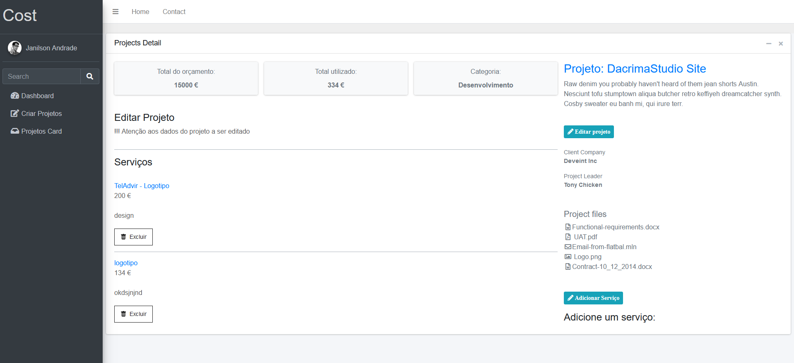

## Minimal Project Management [(Base version)]

> React Project Management made with HTML, CSS & components React json API etc.

| [Covered Content](https://github.com/JailsonA/reactPortfolioegator) |
| ------------------------------------------------------------------- |
| **React**                                                           |
| ✓ HTML                                                              |
| ✓ CSS                                                               |
| ✓ JSX                                                               |
| ✓ Components                                                        |
| ✓ React-icons                                                       |
| ✓ Json API BD                                                       |
| ✓ React Router                                                      |
| ✓ React Hook                                                        |
| ✓ Props (parameter)                                                 |

## Getting started

- Recommended `node js 16.x` and `npm 6+`. (suggestion v16.15.0)
- Install dependencies: `npm install` / `yarn install`
- Install Json-server: `npm install json-server`
- Install react-icons: `npm install react-icons` 
- Install Router-Dom: `npm install router-dom` 
- Install uuid-generate: `npm install uuid` 
- Start the project: `npm run start` / `yarn start`

## Contact

Email: jandoliveira@icloud.com
